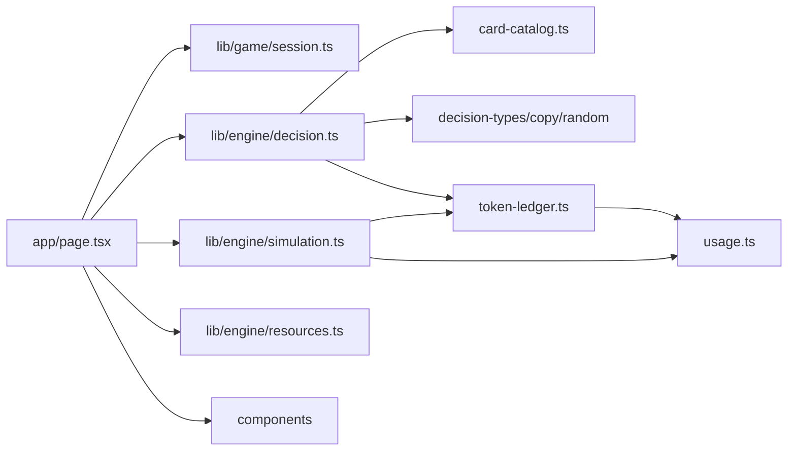

# VvibeCoderSim Architecture

This document describes module boundaries after the refactor. Its purpose is to let a developer or Codex open only the relevant part of the project instead of loading the entire engine into context.

## Data flow

`app/page.tsx` orchestrates game phases and timers, but does not own copy catalogs, resource formulas, or chat JSX. Components render state and invoke handlers; game mutations remain in `lib/engine`.

## Responsibility ownership

| Area | Primary module |
| --- | --- |
| Standard comic choices and effects | `lib/engine/card-catalog.ts` |
| Recovery, deployment strategies, and applying choices | `lib/engine/decision.ts` |
| Decision types | `lib/engine/decision-types.ts` |
| Short response copy | `lib/engine/decision-copy.ts` |
| Deterministic seeds and hashes | `lib/engine/decision-random.ts` |
| Progress and simulated operations | `lib/engine/simulation.ts` |
| Resource extremes and successors | `lib/engine/resources.ts` |
| Pure token and limit formulas | `lib/engine/usage.ts` |
| Token charging and weekly-value migration | `lib/engine/token-ledger.ts` |
| Persistence and UI session types | `lib/game/session.ts` |
| Anonymous usage counters and browser consent | `lib/game/analytics.ts`, `app/api/analytics/route.ts` |
| Chat, paywall, and victory | `components/ChatPanel.tsx` |
| Header and model selection | `components/GameHeader.tsx` |
| Context and weekly limit | `components/ResourceDashboard.tsx` |

## State invariants

- `TaskState` is the single game domain object. Phase, visible messages, and timers are local UI state.
- Game resources are always clamped to `0–100`.
- Working context, chat history, and cumulative token usage are stored separately.
- Only `chargeTokenCall()` increases total, personal, and weekly token usage.
- Simulated operations call `recordWorkContext()` and are not separate model calls.
- A successor clears working context and personal usage, preserves game history and total/weekly usage, then pays the handoff-reading cost.
- Production deployment exists only through `deploymentRun`; normal progress is capped at `99.99%`.
- Deployment choices are separate from standard choices and unlock through the button at `≥95%` progress.
- `deploymentChance` lives in `TaskState`, defaults to `10%`, and determines the actual outcome.

## Persistence

One game is stored in `localStorage` under `vvibe-tasks-reigns-v1`. The `SavedGame` wrapper also stores the current phase and any unfinished work cycle.

`normalizeWeeklyPeriod()` migrates legacy percentage fields (`weeklyUsagePercent` and `weeklyAllowanceBonus`) to exact counters (`weeklyTokensSpent` and `weeklyTokenBonus`). Extra fields from old saves, including the removed character arc, are safely ignored.

Anonymous analytics are disabled until the visitor opts in. The server then issues signed HttpOnly visitor and session identifiers. `analytics.json` under `VVIBECODER_DATA_DIR` contains only those random IDs, game IDs, and timestamps; it never persists request IPs, user agents, project names, or chat content. `/stats` exposes public aggregate totals and lets a browser revoke consent and delete its own record.

Leaderboard submission is a separate explicit action after victory. The write endpoint checks same-origin requests, rejects common automated clients, rate-limits submissions, bounds every field, and stores only the fields disclosed beside the submit button. These checks deter casual abuse; game results are client-generated and are not cryptographic proof of play.

## Keeping development context small

- Search for the symbol with `rg`, then read one relevant module from the ownership table.
- For standard choice changes, use `card-catalog.ts` and its test; do not open `decision.ts`.
- For visual chat changes, use `ChatPanel.tsx` or the specific panel component; do not open the engine.
- Do not restore removed `arc.ts`, `fragments.ts`, `dialogue.ts`, or old panels.
- Keep large copy catalogs separate from algorithms.
- Do not duplicate token formulas outside `usage.ts` and `token-ledger.ts`.

## Production

The container is built through `deploy/compose.production.yml`, listens only on loopback port `8040`, drops Linux capabilities, uses a read-only root filesystem, and has an HTTP health check. Caddy terminates public HTTPS. The repository contains only a generic Caddy fragment; real infrastructure details stay in the private server configuration.
