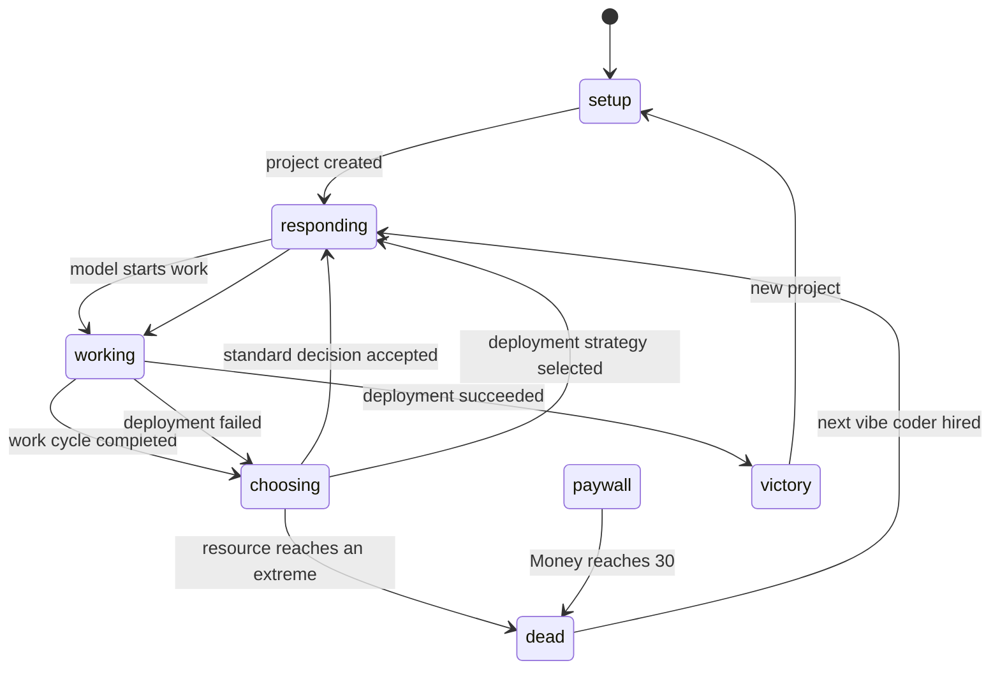

# VvibeCoder Sim Engine

## Phases



## Programmer resources

Three values live in `TaskState.resources` on a `0–100` scale, with a safe corridor of `31–69`:

- `money`: Poverty ↔ Wealth;
- `motivation`: Apathy ↔ Mania;
- `team`: Outcast ↔ Leader.

A new game and every successor start at `50/50/50`. A value at or below `30`, or at or above `70`, moves the game to `dead`. The old chat is replaced by one of six detailed departure stories matching the exact resource boundary.

A successor is not created automatically. **Hire the next vibe coder** calls `createSuccessor()`, increments `programmerGeneration`, restores neutral resources, resets momentum, cancels an unfinished deployment, and removes 4% progress for handoff.

Names come from `PROGRAMMER_NAMES`. `programmerNameCounts` tracks repeated base names; later appearances receive Roman numerals such as `Smoothie Bread II` and `Smoothie Bread III`.

## Decisions

Chat choices serve as the Reigns-style decisions; there are no visual cards or swipe gestures.

Each standard screen selects one choice from each of three thematic pools: outside help, management/team actions, and questionable technical tricks. The 36 comic choices have hand-authored `resourceEffects` and affect only resources that follow logically from their wording. Recovery and deployment choices have their own effects.

Strategy controls pace, command cost, and context growth:

- `quality`: 9,000 command tokens, +1,400 working context, slower progress;
- `product`: 6,000 command tokens, +1,000 context, medium progress;
- `speed`: 3,500 command tokens, +650 context, faster and riskier progress.

Copy length adds a small variable cost, and deployment choices add a strategy-specific cost. These prices do not determine resource effects.

About one in twelve standard screens replaces one choice with a rare `deploymentChanceDelta` decision. Four positive options add 7–12 percentage points but cost 14–20 Money and may affect other resources. Two negative options save Money or Motivation but remove 7 or 9 percentage points. All effects on these special choices are visible.

Choices show only affected resources. Changes of up to 9 points use `+` or `−`; changes of 10 or more use `++` or `−−`. With 28% probability, exactly one affected resource is shown as a gray `?`. Unaffected resources never appear and cannot be hidden.

The hidden result is deterministic for the same state and choice, drawn from `−10…−1` or `+1…+10`; zero is impossible. The model's first acknowledgement line reveals whether the result was positive or negative. Values are then clamped to `0–100` and checked against the `30/70` boundaries. The visible green bar stretches the safe corridor across its full width, with 50 in the center.

## Context

Context is a separate system resource with a model-specific limit. Only Codex is currently selectable:

- Codex: 258,000;
- Claude Code: 200,000;
- Gemini: 1,000,000;
- Grok: 256,000 tokens.

There is no penalty below 60%. Above that threshold:

```text
overflow = max(0, contextRatio - 0.6)
setbackBonus = min(0.5, overflow × 0.55)
tokenMultiplier = 1 + min(3.5, overflow × 2.5)
```

Context pressure therefore raises both setback probability and the cost of the command portion of the next call. Context growth itself is not multiplied and may exceed 100%; the interface shows the actual percentage and cost multiplier.

Each paid call uses:

```text
inputTokens = contextTokens + chatHistoryTokens
commandTokens = baseCommandCost × tokenMultiplier
totalCharge = inputTokens + commandTokens
```

All charges pass through `token-ledger`. `contextTokens` stores working file/tool context, while `chatHistoryTokens` stores user and assistant messages. A player choice creates exactly one paid call. Simulated work operations only add results to future context; they do not charge another full prompt. `totalTokensSpent` tracks the whole project and `programmerTokensSpent` tracks the current programmer.

Hiring a successor resets `contextTokens` and personal token usage, while preserving history, weekly usage, and the project total. Reading the handoff is charged to the successor immediately.

## Weekly limit

Exact weekly usage lives in `TaskState.weeklyTokensSpent`; purchased allowance lives in `weeklyTokenBonus`. The base budget is 500,000 charged tokens. `weeklyTokenBudget` records the budget used by a save so legacy games based on 2,500,000 tokens can be migrated proportionally.

`weeklyResetAt` points to the next Sunday at 00:00 in browser-local time. At that moment usage and purchased allowance reset, and a paused game returns to choosing. Programmer departure does not reset weekly usage; a new project does.

At 100% usage, the game enters `paywall`, stops work timers, disables model switching, and presents exactly four options:

- **Pay Codex a little**: spend 5 Money and add 20% of the base weekly budget.
- **Pay Codex a lot**: spend 10 Money and add 100%.
- **Try free models**: add one third of the base budget, lose 7% progress, 9 Motivation, and 11 Team.
- **Try coding it yourself**: always enter `dead` with the dedicated **Manual Mode** ending.

Payments directly reduce Money. Free models can push Motivation or Team to a normal extreme. Any acquired allowance survives for the successor. The manual ending is persisted in `TaskState.departureMessage`.

## Work and progress

Between decisions, `SimulationEngine` generates simulated file and command operations. They change project progress, not programmer resources.

The first 75% advances quickly. Later gains shrink while setbacks become more likely. Normal development is capped at `99.99%`; only a successful production deployment can complete the game.

The old personality-degradation system and its text pools have been removed. Risk depends only on progress, strategy, and context pressure.

## Deployment

The project header always shows a deploy button with the current chance. It unlocks at `95%`. The player may continue normal work or open three deployment choices selected from six strategies:

- canary;
- blue-green;
- rolling update;
- DNS switch;
- migration first;
- direct production deployment.

An information control explains the base chance, decision changes, readiness bonus, previous-failure bonus, and total.

`TaskState.deploymentChance` stores the base chance plus accumulated decision changes and starts at `10%`. Each complete progress point above 94 adds 3 percentage points: +3 at 95%, +6 at 96%, and up to +15 at 99%. Each completed failure adds another 5 points through `failedDeployments`. The total is clamped to `0–100` and determines the actual result.

The selected strategy's resource effects are applied first. If a resource reaches an extreme, the programmer departs and the deployment is canceled.

A successful deployment runs eight positive operations and ends at `Deployed`, `100%`, and `victory`. The result screen lists the chronological `programmerRoster`, total tokens, final-programmer tokens, final context, and failed deployments. The only sharing action opens the official `t.me/share/url` endpoint. There is no Web Share or clipboard flow.

A failed deployment runs an incident sequence, lowers progress, creates backlog tasks, increments `failedDeployments`, and returns the player to a recovery decision.

## Persistence

The active game is stored in `localStorage` under `vvibe-tasks-reigns-v1`, including:

- project and progress;
- the most recent 50 events;
- model personality and three resources;
- working context, chat estimate, and total usage;
- current-programmer and weekly token usage;
- purchased allowance and next reset date;
- current phase and unfinished work-cycle data;
- programmer generation and chronological roster;
- deployment chance changes, failures, and deployment state.

After reload, chat is reconstructed from recent events and the game returns to the decision, departure, or victory screen.

## Manual verification

- A new project begins at `50/50/50`.
- Every choice shows only effects it actually changes, and selecting it updates the header bars immediately.
- Above 60% context, the cost multiplier and setback frequency increase.
- Weekly allowance decreases monotonically and stops work at 0% remaining.
- The paywall shows only two Codex payments, free models, and manual coding.
- Manual coding always opens its own departure screen.
- Reaching `30` or `70` on any resource clears chat and shows the matching departure story.
- No successor exists before **Hire the next vibe coder** is selected.
- A successor receives neutral resources and empty working context while the project loses 4% progress.
- Deployment stays disabled below 95%; readiness and completed failures add the documented bonuses.
- Rare expensive decisions improve deployment chance; risky savings may reduce it.
- Deployment success and incident/recovery follow the displayed probability.
- Victory and an active game both survive reload.
- **New Task** clears the current game completely.
